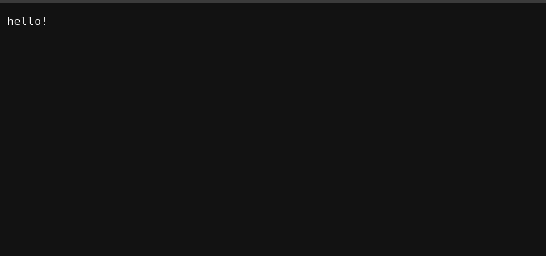
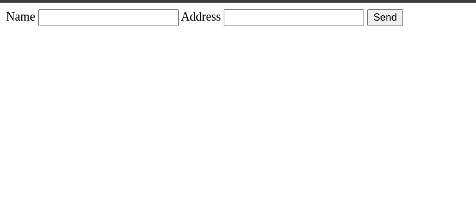

## A simple web server using GO

```bash
# To install
git clone https://github.com/code-pisces/go-simple-server
go install
go run main.go
# server will run in port 8000
```

### Pages: 

<div>
<b>/index.html</b> ou <b>/</b>

</div>

<div>
<b>/hello</b>

</div>

<div>
<b>/form.html</b>

</div>